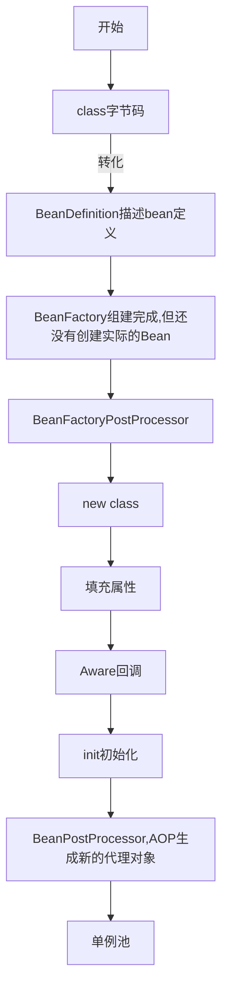

#  SPRING

[TOC]

## Bean生命周期

简化流程：


详细流程图：





### BeanFactory


### BeanDefinition

构成


BeanFactory组建完成，得到的是BeanDefinition对象集合

### BeanDefinitionRegistrar

**ImportBeanDefinitionRegistrar**向容器（beanDefinitionMap）中注册自定义的BeanDefinition

```java
public class CustomBeanDefinitionRegistrar implements ImportBeanDefinitionRegistrar {
    
    @Override
    public void registerBeanDefinitions(AnnotationMetadata importingclassMetadata, BeanDefinitionRegistry registry) {
        //mapper集合，可改成通过注解扫码包方式获取到所有的mapper
        List<Class> mappers = new ArrayList<>();
        mappers.add(UserMapper.class);
        mappers.add(orderMapper.class);
        for (class mapper :mappers){
            BeanDefinitionBuilder builder = BeanDefinitionBuilder.genericBeanDefinition();
            AbstractBeanDefinition beanDefinition = builder.getBeanDefinition();
            //改变bean的class
            beanDefinition.setBeanclass(CustomFactoryBean.class);
            //设置bean构造函数的参数
            beanDefinition.getconstructorArgumentvalues().addGenericArgumentValue(mapper);
            //向容器中注册不同的mapper,会根据不同的构造函数参数生成生成不同的对象bean
            registry.registerBeanDefinition(mapper.getsimpleName(), beanDefinition);
        }
    }
}
```


### BeanFactoryPostProcessor

**BeanFactory的后置处理器**,BeanFactory组建完成,可以使用该接口修改BeanDefinition

```java
class CustomBeanFactoryPostProcessor implements BeanFactoryPostProcessor {
        @Override
        public void postProcessBeanFactory(ConfigurableListableBeanFactory beanFactory) throws BeansException {
            GenericBeanDefinition beanDefinition = (GenericBeanDefinition) beanFactory.getBeanDefinition("userService");
            Class<?> beanClass = beanDefinition.getBeanClass();

            //1.BeanFactory组建完成后可以更改定义的类
            beanDefinition.setBeanClass(OrderService.class);

            //获取bean，此时bean还没有，需要先创建再返回。
            //此时通过userService名称获取到的是OrderService类型的bean
            beanFactory.getBean("userService");

            //2.注册其他bean,非正常流程创建的bean。例如mybatis的mapper代理bean
            beanFactory.registerSingleton("customBean",CustomBean);
        }
    }
```


### FactoryBean

通过该接口，可以生成或修改对象生成的bean，也可以生成代理对象。例如可以通过该对象生成mybatis中mapper.xml对应的bean

**通过BeanFactoryPostProcessor实现生成mybatis的mapper代理对象**

```java
class CustomFactoryBean implements FactoryBean{
        private Class mappper;
        public CustomFactoryBean(Class clazz){
            this.mappper = clazz;
        }
        @Override
        public Object getObject() throws Exception {
            return Proxy.newProxyInstance(mappper.getClassLoader(), new Class[]{mappper}, 
                                          (proxy, method, args) -> method.invoke(proxy,args));
        }
        @Override
        public Class<?> getObjectType() {
            return null;
        }
    }
```

### Aware

填充属性后，执行各种回调

例如：BeanNameAware，BeanFactoryAware,ApplicationContextAware

### init

初始化,执行各种初始化回调

例如：InitiallizingBean，PostConstruct

### BeanPostProcessor

**Bean的后置处理器**,bean初始化后，可以使用该接口进行bean的一些初始化操作


### BeanFactory单例池

默认的实现：**DefaultListableBeanFactory**


## Spring循环依赖

**注意：**==spring没有解决构造器的循环依赖==

循环依赖描述： 


原因分析及解决思路：


### singletonObjects(一级缓存)

一级缓存： 用于存放完全初始化好的 bean，**从该缓存中取出的 bean 可以直接使用**

```java
/** Cache of singleton objects: bean name to bean instance. */
private final Map<String, Object> singletonObjects = new ConcurrentHashMap<>(256);
```

### earlySingletonObjects(二级缓存)

二级缓存：存放原始的 bean 对象或者拿原始对象进行了AOP之后的得到的代理对象，原始对象还未惊醒属性注入和后续的BeanPostProcessor等生命周期

```java
/** Cache of early singleton objects: bean name to bean instance. */
private final Map<String, Object> earlySingletonObjects = new HashMap<>(16);
```

### singletonFactories(三级缓存)

缓存的是一个**ObjectFactory**,主要用来去生成原始对象进行了AOP之后得到的代理对象，如果没有AOP则生成原始对象，ObjectFactory是一个生成bean的lambda表达式，这个表达式定义了怎样生成bean(生成原始bean或者代原始bean代理后的bean)。在每个Bean的生成过程中，都会提前暴露一个工厂，这个工厂可能用到，也可能用不到，如果没有出现循环依赖依赖本bean,那么这个工厂无用，本bean按照自己的生命周期执行，执行完后直接把本bean放入singletonObjects中即可，如果出现了循环依赖依赖了本bean,则另外那个bean执行ObjectFactory提交得到一个AOP之后的代理对象，并将该对象放入到二级缓存中。

```java
/** Cache of singleton factories: bean name to ObjectFactory. */
private final Map<String, ObjectFactory<?>> singletonFactories = new HashMap<>(16);
```


### earlyProxyReferences 

这也是一个缓存，记录了某个原始对象是否进行过aop了。


如果只有二级缓存可以解决一般的循环依赖，但是无法解决aop产生的的循环依赖