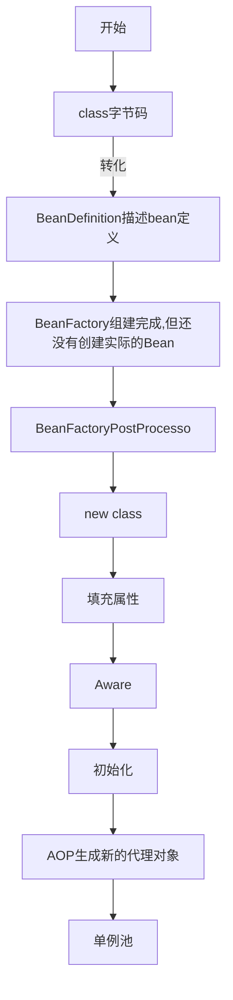

# SPRING

[TOC]

## Spring循环依赖

循环依赖描述：


原因分析及解决思路：


## Bean生命周期





### BeanFactory


### BeanDefinition

构成


BeanFactory组建完成，得到的是BeanDefinition对象集合

### BeanFactoryPostProcessor

**BeanFactory的后置处理器**,BeanFactory组建完成,可以使用该接口修改BeanDefinition

```java
class CustomBeanFactoryPostProcessor implements BeanFactoryPostProcessor {
        @Override
        public void postProcessBeanFactory(ConfigurableListableBeanFactory beanFactory) throws BeansException {
            GenericBeanDefinition beanDefinition = (GenericBeanDefinition) beanFactory.getBeanDefinition("userService");
            Class<?> beanClass = beanDefinition.getBeanClass();

            //1.BeanFactory组建完成后可以更改定义的类
            beanDefinition.setBeanClass(OrderService.class);

            //获取bean，此时bean还没有，需要先创建再返回。
            //此时通过userService名称获取到的是OrderService类型的bean
            beanFactory.getBean("userService");

            //2.注册其他bean,非正常流程创建的bean。例如mybatis的mapper代理bean
            beanFactory.registerSingleton("customBean",CustomBean);
        }
    }
```


### FactoryBean

**通过BeanFactoryPostProcessor实现生成mybatis的mapper代理对象**

```java
class CustomFactoryBean implements FactoryBean{
        private Class mappper;
        public CustomFactoryBean(Class clazz){
            this.mappper = clazz;
        }
        @Override
        public Object getObject() throws Exception {
            return Proxy.newProxyInstance(mappper.getClassLoader(), new Class[]{mappper}, 
                                          (proxy, method, args) -> method.invoke(proxy,args));
        }
        @Override
        public Class<?> getObjectType() {
            return null;
        }
    }
```

BeanDefinitionRegistrar:用来在beanFactory组建完成后，注册自定义的BeanDefinition

```java
public void registerBeanDefinitions(AnnotationMetadata importingclassMetadata, BeanDefinitionRegistry) {
        //mapper集合，可改成通过注解扫码包方式获取到所有的mapper
        List<Class> mappers = new ArrayList<>();
        mappers.add(UserMapper.class);
        mappers.add(orderMapper.class);
        for (class mapper :mappers){
            BeanDefinitionBuilder builder = BeanDefinitionBuilder.genericBeanDefinition();
            AbstractBeanDefinition beanDefinition = builder.getBeanDefinition();
            //改变bean的class
            beanDefinition.setBeanclass(CustomFactoryBean.class);
            //设置bean构造函数的参数
       beanDefinition.getconstructorArgumentvalues().addGenericArgumentValue(mapper);	   
            //向容器中注册不同的mapper,会根据不同的构造函数参数生成生成不同的对象bean
            registry.registerBeanDefinition(mapper.getsimpleName(), beanDefinition);
        }
    }
```

### Aware,init


### BeanPostProcessor

**Bean的后置处理器**,bean初始化后，可以使用该接口进行bean的一些初始化操作


### 单例池

ConCurrentHashMap