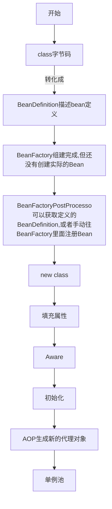

# SPRING

## bean生命周期

```mermaid
graph TD
开始--> A[class字节码] --转化成-->BeanDefinition描述bean定义-->BeanFactory组建完成,但还没有创建实际的Bean-->BeanFactoryPostProcesso可以获取定义的BeanDefinition,或者手动往BeanFactory里面注册Bean-->B[new class]-->填充属性-->Aware
-->初始化-->AOP生成新的代理对象-->单例池
```

FactoryBean

BeanDefinition

BeanFactory组建完成，得到的是BeanDefinition对象集合

BeanFactoryPostProcessor（BeanFactory的后置处理器），可以修改BeanDefinition定义

BeanPostProcessor(Bean的后置处理器)

